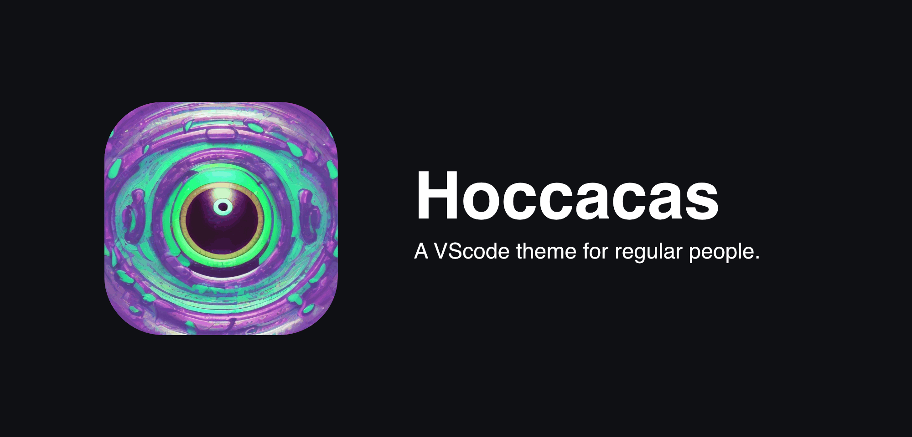
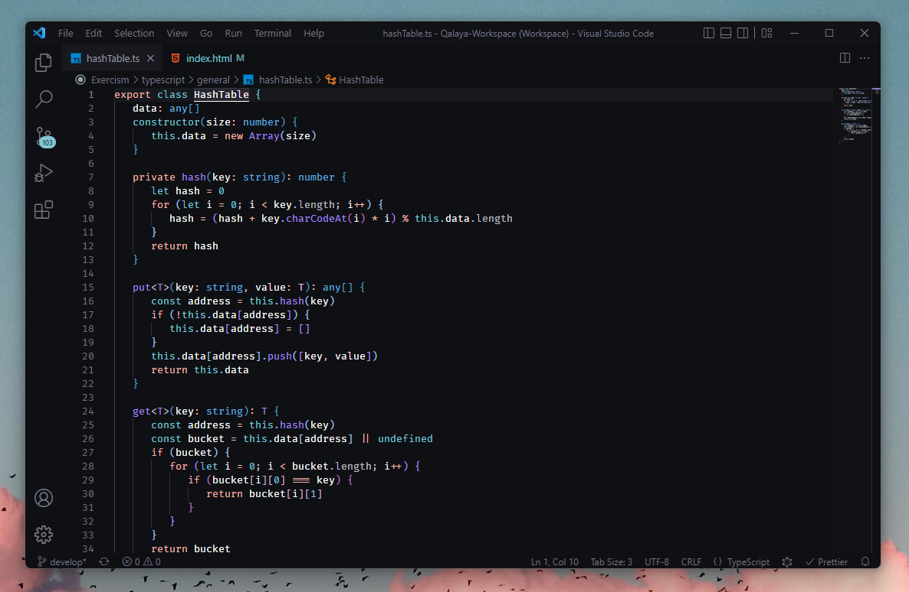
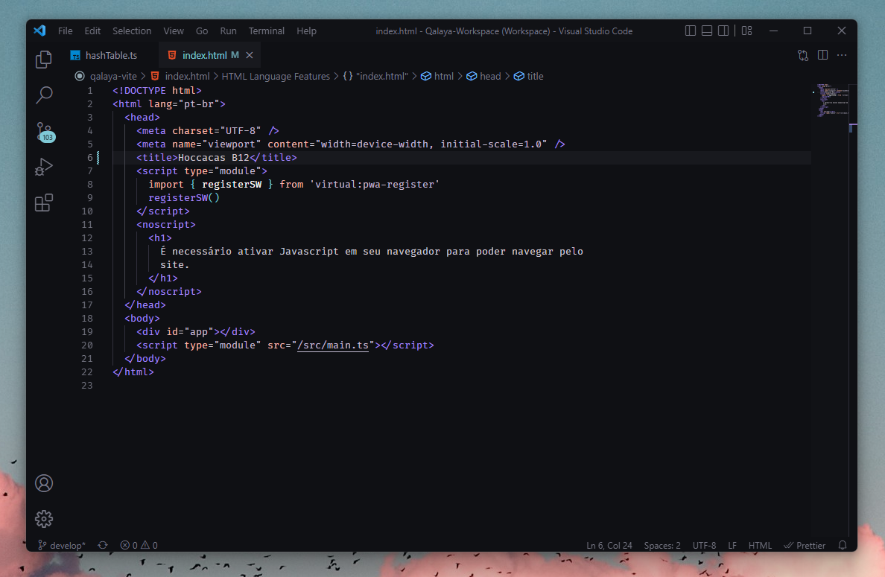

# Hoccacas

## Installation

1. Open **Extensions** sidebar panel in VS Code. `View → Extensions`. (Ctrl+Shift+X)
2. Search for "Hoccacas".
3. Click **Install** to install it.
4. VS Code > Preferences > Color Theme (Ctrl+K Ctrl+T) > Hoccacas Anemic or Hoccacas B12.

## Hoccacas Anemic

This is the standard version of Hoccacas. Colors are less saturated here and HTML has less color variations.

## Hoccacas B12

Hoccacas B12 has some color saturation enhancements and minor color syntax changes.

