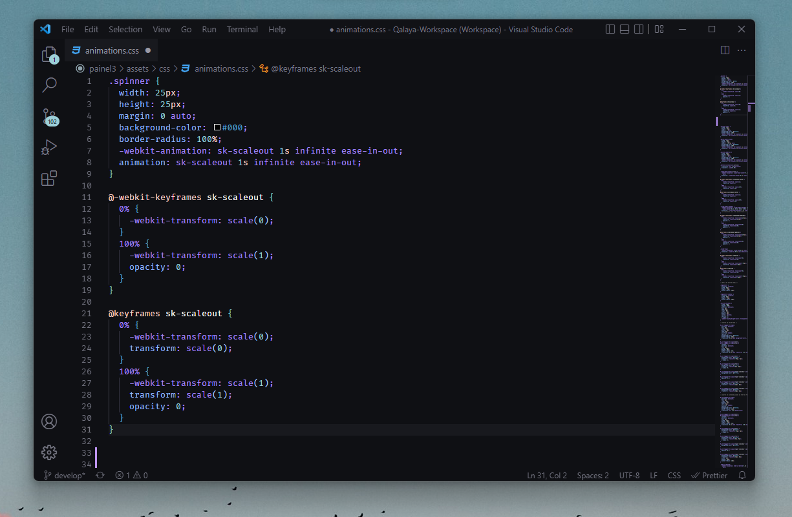

# Hoccacas

## Installation

1. Open **Extensions** sidebar panel in VS Code. `View → Extensions`. (Ctrl+Shift+X)
2. Search for "Hoccacas".
3. Click **Install** to install it.
4. VS Code > Preferences > Color Theme (Ctrl+K Ctrl+T) > Hoccacas Drac, Hoccacas Fersk, Hoccacas B12 or Hoccacas Pale.

## Hoccacas Drac

This is the new standard version of Hoccacas (16/04/2023). Colors are following new syntax colors because I got bored of B12 version and Fersk version.

## Hoccacas Fersk

This is a new version of Hoccacas (09/04/2023). Colors are following new syntax colors because I got bored. It's funny to notice that I got bored of it too (16/04/2023) and beacuse of that managed to create the Drac version. xD

## Hoccacas B12

This is the classic version of Hoccacas. Colors are more vibrant than Pale version and it has more syntax color variations.

## Hoccacas Pale

It is a pale version of Hoccacas B12. It has less vibrant colors and less syntax color variations.

