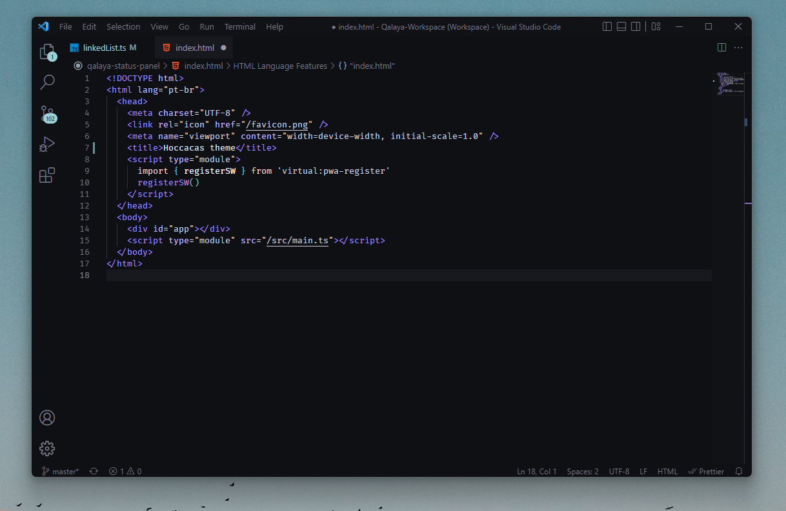

# Hoccacas

## Installation

1. Open **Extensions** sidebar panel in VS Code. `View → Extensions`
2. Search for "Hoccacas"
3. Click **Install** to install it.
4. VS Code > Preferences > Color Theme > Hoccacas

## Observations

I don't have much to say here. It's just a theme to fit my taste based on things that I consider as flaws in other themes around.
